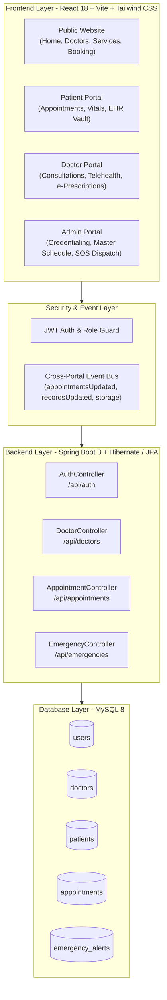

# 🏥 SmartHealth — Intelligent Healthcare Management System

> An enterprise-grade, real-time healthcare ecosystem bridging **Patients**, **Certified Physicians**, and **Hospital Administrators** with end-to-end clinical synchronization, virtual telehealth, medical credential verification, and rapid emergency dispatch.

---

## 🌟 Key Highlights

*   🛡️ **Multi-Role Clinical RBAC:** Dedicated portals for **Patients**, **Doctors**, and **Hospital Administrators** with strict data scoping and zero cross-doctor visibility.
*   🩺 **Practitioner Credentialing Gate:** Doctor sign-ups are routed to an administrative verification queue (`PENDING_APPROVAL`) requiring license validation before clinical login.
*   📹 **Virtual Telehealth Consultation:** Integrated WebRTC video room with real-time consultation timers, in-call chat, and media controls.
*   💊 **Digital Prescription Vault:** Electronic prescriptions drafted by physicians are dispatched directly into the patient's EHR vault with instant synchronization.
*   🚨 **Emergency SOS & GPS Dispatch:** Rapid patient trauma trigger with Web Audio oscillator sirens, active triage logging, and Google Maps live navigation.
*   📅 **Central Hospital Master Schedule:** Unified administrative oversight of all hospital consultations with specialist filtering, status auditing, and conflict resolution.
*   📱 **Responsive Mobile Drawer & Collapsible Mini-Sidebar:** Icon-only shrink mode (`w-20` / `w-64`) with floating edge toggles and mobile hamburger drawer across all three dashboards.

---

## 🏗️ System Architecture



---

## 📊 Role-by-Role Feature Matrix

| Feature Module | 👤 Patient Portal | 🧑‍⚕️ Doctor Portal | 🏥 Admin Operations |
| :--- | :---: | :---: | :---: |
| **Authentication & Access** | Direct Self-Registration | License Verification Gate | Dedicated Admin Gateway |
| **Dashboard KPIs** | Upcoming Visits & Vitals | Real-time Queue & Reviews | Hospital Occupancy & Revenue |
| **Appointment Booking** | 5-Step Flow & Payment Sim | View & Manage Queue | Master Hospital Roster |
| **Status Actions** | Cancel Visit | Approve / Complete / Cancel | Centrally Override Status |
| **Telehealth Rooms** | Join Video Consultation | "Start Call" Virtual Room | Audio/Video Audit Metrics |
| **Medical Records** | Encrypted EHR Vault (PDFs) | Draft & Transmit Rx to Vault | Audit Clinical Logs |
| **Health Vitals Tracker** | 5-Metric Tracker & Modals | View Patient Biometrics | Population Health Overview |
| **Doctor Directory** | Search & Filter by Specialty | Profile Locked (No Peeking) | Onboard, Approve, Suspend |
| **Doctor Photo Uploader** | View Specialist Headshot | View Personal Avatar | File Picker & Live Preview |
| **Emergency SOS** | One-Click Geolocation SOS | Emergency Bell Notification | Live Siren Tone + GPS Map |
| **Help Centers** | Patient FAQs & Billing Help | Clinical SOPs & Code Blue Line | Administrative SOPs & IT Desk |
| **Sidebar Collapse** | Icon-Only Floating Toggle | Icon-Only Floating Toggle | Icon-Only Floating Toggle |
| **Mobile Drawer** | Touch Drawer + Hamburger | Touch Drawer + Hamburger | Touch Drawer + Hamburger |
| **Sign Out Alert** | Styled Confirmation Modal | Styled Confirmation Modal | Styled Confirmation Modal |

---

## 🔑 Demo Credentials (Ready for Testing & Evaluation)

All accounts are pre-seeded in the database and ready for immediate login:

| Role | Email / Identifier | Password | Destination Dashboard |
| :--- | :--- | :--- | :--- |
| **Administrator** | `admin@smarthealth.com` | `Admin@123` | [Admin Portal](http://localhost:5173/admin/login) (`/admin/dashboard`) |
| **Doctor (Senior)** | `ananya.sharma@smarthealth.com` | `password123` | [Doctor Portal](http://localhost:5173/login) (`/doctor/dashboard`) |
| **Doctor (Alternate)**| `sarah.jenkins@smarthealth.com` | `password123` | [Doctor Portal](http://localhost:5173/login) (`/doctor/dashboard`) |
| **Patient (Demo)** | `patient@smarthealth.com` | `password123` | [Patient Portal](http://localhost:5173/login) (`/patient/dashboard`) |
| **Patient (Personal)**| `manishpawar172003@gmail.com` | `password123` | [Patient Portal](http://localhost:5173/login) (`/patient/dashboard`) |

> [!NOTE]
> Public Doctor Sign-ups (`/register`) are automatically assigned `PENDING_APPROVAL` status. Log in as **Admin** (`/admin/dashboard` → **Doctors**) to verify and activate newly registered doctors!

---

## 🚀 Quick Start Guide

### Prerequisites
*   **Java:** JDK 17 or higher
*   **Maven:** 3.8+
*   **Node.js:** v18.0.0 or higher
*   **MySQL Server:** 8.0+ running on port `3306`

---

### 1. Database Setup
Log into your MySQL client and create the database:
```sql
CREATE DATABASE IF NOT EXISTS Smart_health;
```

Ensure `Backend/src/main/resources/application.properties` matches your MySQL credentials:
```properties
spring.datasource.url=jdbc:mysql://localhost:3306/Smart_health?createDatabaseIfNotExist=true&useSSL=false
spring.datasource.username=root
spring.datasource.password=root@1234
spring.jpa.hibernate.ddl-auto=update
```

---

### 2. Backend Startup (Spring Boot)
Open a terminal in the `Backend/` directory:
```bash
cd Backend
mvn clean spring-boot:run
```
*   Server starts on: **`http://localhost:8080`**
*   Dispatcher Servlet initializes with endpoints mapped for Auth, Doctors, Appointments, and Emergencies.

---

### 3. Frontend Startup (React + Vite)
Open a second terminal in the `Frontend/` directory:
```bash
cd Frontend
npm install
npm run dev
```
*   Application opens on: **`http://localhost:5173`**

---

## 📡 REST API Reference

### 🔐 Authentication (`/api/auth`)
*   `POST /api/auth/register` — Register a new patient or doctor (doctors assigned `PENDING_APPROVAL`).
*   `POST /api/auth/login` — Authenticate credentials, enforce approval gates, and issue JWT session.

### 🩺 Doctor Registry (`/api/doctors`)
*   `GET /api/doctors` — Retrieve all active hospital practitioners.
*   `GET /api/doctors/{id}` — Retrieve detailed profile for an individual physician.
*   `POST /api/doctors` — Admin endpoint to onboard a doctor with license, fee, and photo.
*   `PUT /api/doctors/{id}/status?status=ACTIVE|SUSPENDED` — Admin approves license or suspends account.
*   `DELETE /api/doctors/{id}` — Remove practitioner from registry.

### 📅 Appointments (`/api/appointments`)
*   `GET /api/appointments` — Admin master hospital roster across all doctors.
*   `GET /api/appointments/doctor-id/{doctorId}` — Retrieve appointments strictly for an individual doctor.
*   `GET /api/appointments/patient/{userId}` — Retrieve consultation history for an authenticated patient.
*   `POST /api/appointments/book` — Book consultation with slot conflict locking and payment status.
*   `PUT /api/appointments/{id}/status?status=CONFIRMED|COMPLETED|CANCELLED` — Transition visit status.

### 🚨 Emergency Response (`/api/emergencies`)
*   `POST /api/emergencies/trigger` — Patient SOS trigger with GPS latitude and longitude.
*   `GET /api/emergencies/active` — Active triage alerts consumed by Admin audio sirens and Doctor bells.
*   `PUT /api/emergencies/{id}/resolve` — Mark incident resolved and dispatch ambulance teams.

---

## 🔒 Healthcare Privacy & Security Compliance

*   **Scoping & HIPAA Guidelines:** Doctors cannot view appointments, medical history, or charts of patients assigned to other specialists.
*   **Password Encryption:** All passwords salted and hashed via Spring Security's `BCryptPasswordEncoder`.
*   **Operating Hours Validation:** Appointments are restricted to clinical hours (08:30 AM – 08:00 PM), reserving night slots for Emergency SOS triage.
*   **Fail-Safe Data Serialization:** Base64 avatars and clinical documents stored with `LONGTEXT` definitions to prevent data truncation.

---

## 💻 Tech Stack Summary

*   **Frontend:** React 18, Vite 8, Tailwind CSS, Framer Motion, Lucide Icons, Web Audio API
*   **Backend:** Spring Boot 3.3, Spring Security, Spring Data JPA, Hibernate, Jakarta Validation
*   **Database:** MySQL 8.0
*   **Architecture:** RESTful Micro-services, Event-driven frontend synchronization
